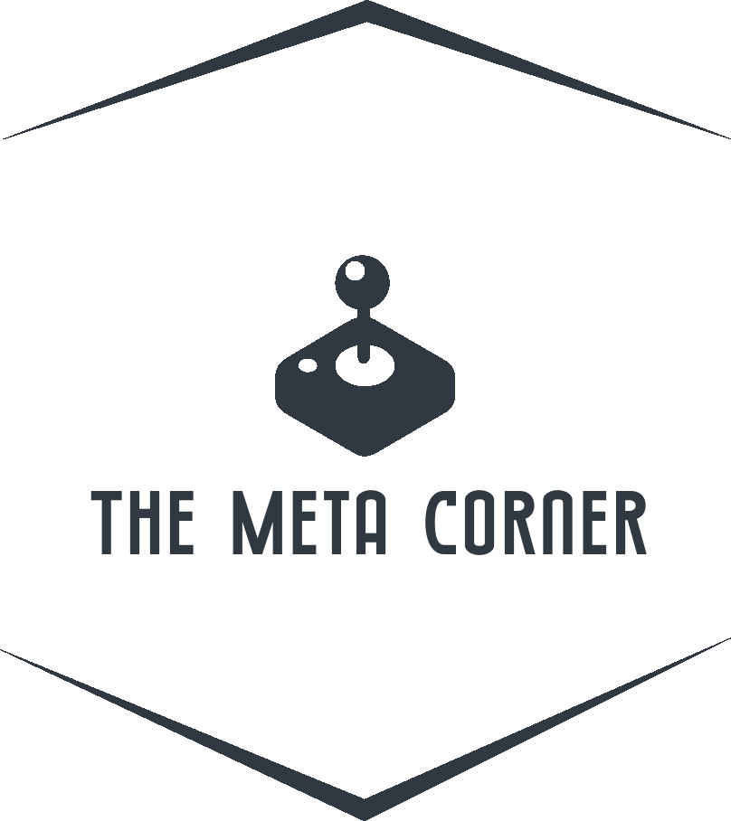

# Game Hub



A school project blog site

## Description

This project is a school assignment, where I was tasked to create a blog website.

It contains:

- Homepage
- Contact page
- About page
- A blog list page
- A blog specific page

## Built With

This project was build using:

- HTML 5
- CSS
- Javascript
- Wordpress (headless)

## Getting Started

### Installing

1. Clone the repo:

```bash
git https://github.com/Noroff-FEU-Assignments/project-exam-1-Olekrr.git
```


## Contributing

This is a finished school project, and is therefore not open for contributions

## Contact

To get in contact with me, please use one of the below options:

- Email: olekrrasmussen@gmail.com
- Discord: "Ole Kristian#5413"

## Acknowledgments

[Noroff](https://www.noroff.no/en)
